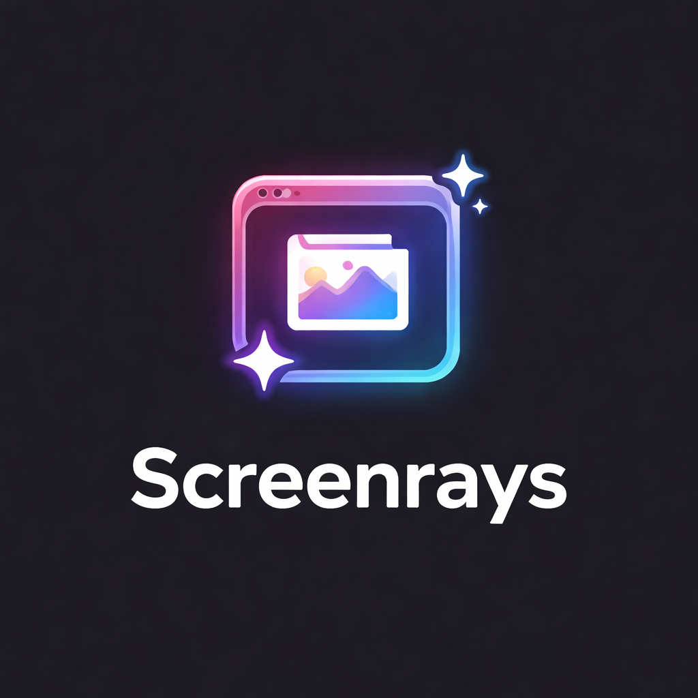

<p align="center">
  
</p>

<h1 align="center">ScreenRays</h1>

<p align="center">
  Automatically copies new screenshots to your Raycast Clipboard History.<br/>
  Never lose a screenshot again — take a screenshot, and it's ready to paste wherever you need it.
</p>

## Features

- Monitors your screenshots folder in the background and copies new screenshots to the clipboard automatically
- Menu bar icon for quick access to your 10 most recent screenshots
- Click any screenshot in the menu to copy it on demand
- Open your screenshots folder directly from the menu bar

## Setup

1. Install the extension
2. Set your **Screenshots Directory** in the extension preferences (defaults to `~/Desktop/Screenshots`)
3. Enable **Background Refresh** in Raycast settings for the extension
4. Take a screenshot — it will appear in your Raycast Clipboard History within seconds

### macOS Screenshot Location

If you've customized where macOS saves screenshots, make sure the extension preference matches. You can check your current screenshot location by running:

```bash
defaults read com.apple.screencapture location
```

## Preferences

| Preference            | Type      | Default                 | Description                                            |
| --------------------- | --------- | ----------------------- | ------------------------------------------------------ |
| Screenshots Directory | Directory | `~/Desktop/Screenshots` | The folder where your screenshots are saved            |
| Enable Logging        | Checkbox  | Off                     | Log debug information to the Raycast developer console |

## Troubleshooting

- **Screenshots not appearing in clipboard history?** Make sure Background Refresh is enabled in Raycast Settings > Extensions > ScreenRays.
- **Wrong folder?** Open the extension preferences and verify the screenshots directory path matches where macOS saves your screenshots.
- **Need to debug?** Enable the "Enable Logging" preference, then check the Raycast developer console for output.
